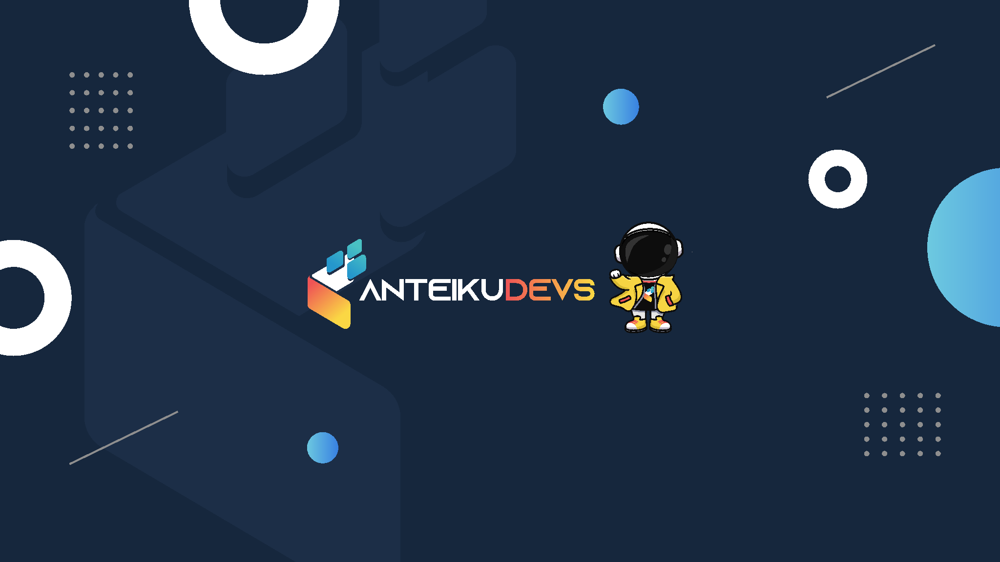

### Halo Semua 👋
### Perkenalkan saya Teguh Sugiarto.

Saya merupakan seorang Fullstack Web Developer berpengalaman lebih dari 4 tahun di bidang IT. Dengan latar belakang yang kuat dalam pengembangan web, saya telah berhasil menggabungkan keahlian dalam front-end dan back-end development untuk menciptakan solusi digital yang inovatif dan efisien

### 🏷️ &nbsp;Tentang Saya

- 🏅&nbsp;Telah menyelesaikan 185+ Website
- 👑&nbsp;Bekerjasama dengan 5 Perusahaan
- ✨&nbsp;Mempunyai 11+ Sertifikat 
- 🧑‍💻&nbsp;Pengalaman lebih dari 5+ Tahun
 

### 🎗️ Keahlian

  
  
  
   
    
  
  
  
  
  
  
  
  
  
  

 

### 🧩 Tools

  
  

 

<!-- ### 💻 Sistem Operasi

  

  -->
    
### 〽️ Statistik Saya

    
    
    <!--  --> 

 

### 💌 Sosial Media Saya

  
  
  
  
  
  
  

